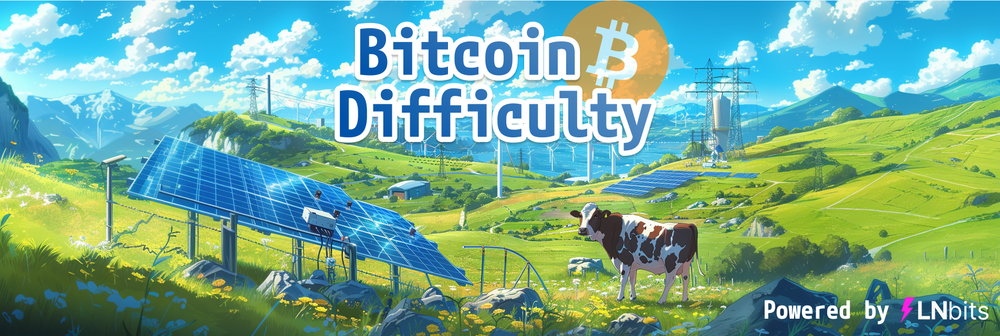
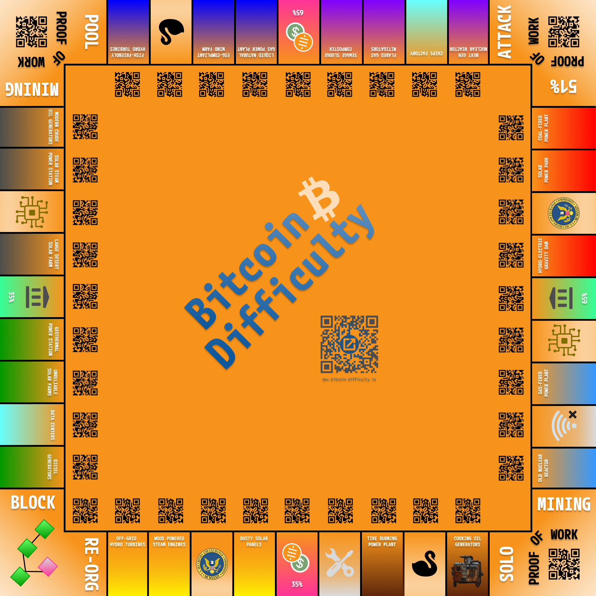

Bitcoin Difficulty
==================

A strategy board game about Bitcoin mining and stacking sats, rocking Lightning wallets and packed with Bitcoin
culture and education pills!

Powered by **[LNBits](https://github.com/lnbits/lnbits)**

# Game
**Buy power stations and fire up your Bitcoin miners, hodl your hard-earned _sats_ to survive through halvings, bear
markets and difficulty adjustments, avoid getting _rekt_ by black swans or government regulations and build the most
profitable Bitcoin mining operation to win the game!**

_Bitcoin Difficulty_ is about building a profitable Bitcoin mining operation to earn as many _sats_ as possible while
crushing the competition. To do so, players must acquire and operate power stations to power their Bitcoin miners and
mine  _sats_ as their main source of income.

While growing their Bitcoin mining business, players must keep up with the total hash rate and difficulty adjustments,
survive through halvings and Bitcoin price volatility, and avoid getting _rekt_ by black swans, government interventions,
hacks or third-party bankruptcies.

While the most risk-averse will simply hodl their _sats_, others may try to time (or manipulate) the market by trading
them for fiat _bucks_, or even hope to earn a so called "risk-free" yield by staking them on a centralized exchange. On
the other hand, playing the _fiat_ game could be a good strategy as the bank will print unlimited amounts of _bucks_ to
finance players who consistently honor their interest payments.

## Board prototype (work in progress)

## App design prototype (work in progress)

## How to play
To play the game you'll need the physical game board with two dices and a pawn for each player. Each player will also
need a smartphone to run the _Bitcoin Difficulty_ web app.

Players play one after the other and move their pawn on the physical board by a number of squares determined with a
dices roll. Each square on the board is presented with a QR code which can be scanned using the _Bitcoin Difficulty_ web
app running in the player's mobile browser.

The app keeps track of the state of the game and embeds an automatically generated _Lightning_ wallet for each player.
The app is used for all game interactions: scanning QRs on the board, mining blocks to earn _sats_, making payments,
drawing cards, etc...

All payments are made with real _Bitcoin_ on the _Lightning_ network, although given the tiny amounts typically used to
play the game we'll use the _sats_ denomination (100,000,000 _sats_ == 1 _Bitcoin_). The player who creates the game is
required to fund it by paying the game's _funding invoice_ from any _Lightning_ wallet, but can also ask other players
to chip in any amount by paying the _funding LNURL_. Provided they don't get fully _rekt_, players may go home with some
_sats_ in their wallet at the end of the game.

### Starting and joining a game
To create a new game go to [https://dev.bitcoin-difficulty.io/play](https://dev.bitcoin-difficulty.io/play) (**public
access is not open yet, please get in touch with our team on X or Telegram if you would like to get access**).

Once a new game has been created and funded by paying the funding invoice, the player who created the game can generate
an _invite QR code_ and invite up to 5 other players to the game.

In order to join an already created game, just scan the invite QR code with your device camera an open its URL in your
mobile browser.

Upon creating or joining a game, all players are given an illustrious Bitcoiner's name and an empty _LNBits_ Lightning
wallet.

**It is recommended that all players bookmark the game URL in order to be able to restore their wallet if needed.
Remember to keep that URL for yourself as anyone with that URL could steal your funds!**

Once all invited players have joined, the player who created the game can start the game for everyone.

### Game mechanics (work in progress)

#### Bitcoin price
While players earn _sats_ by mining blocks on the Bitcoin blockchain, most goods and services are priced in _bucks ($)_.
The _Buck_ is a classic government-issued fiat currency subject to unlimited monetary inflation.

The price of _sats_ in _bucks_ is updated at every block and can be impacted by black swan events, government
regulations and trading happening on the Bitcoin exchange (see: _How does the Bitcoin Exchange work_).

When paying for goods and services priced in _bucks_ throughout the game, players can pay directly from their Lightning
wallet(sending the corresponding amount of _sats_ based on the current _sats/$_ exchange rate) or they can choose to pay
from their bank account if they have one (see: _How does the Bank work_).

#### Bitcoin mining

_Mining a block_ requires the player to provide a **_proof of work_** in the form of **_hashes (#)_**. The more hashes are
included in the proof of work, the most likely it is for a player to successfully mine a block with it.

Hashes (#) are produced by **_miners_** and miners have to be powered with energy. To power their miners, players acquire
and operate **_power stations_** which are represented as squares on the game board. There are various kinds of power
stations, each with their own characteristics (base cost, cost per miner, scalability, inertia, capacity).

Operating a power station and its miners comes with a **power bill** that has to be paid every time a player attempts to
mine a new block by providing a proof of work.

Before they start their journey in the Bitcoin mining industry, players are only able to mine on their personal laptops
from public libraries or their parents basement. Although it is not much, it still counts as proof of work and players
get to start the game with 10 **free** hashes each.

#### Block rewards
When a player successfully mines a block, the player is rewarded with _sats_ (sent to his _Lightning_ wallet)
corresponding to the **_block reward_** as well as **_transaction fees_** from all the transactions included in that
block.

**The block reward value is halved every 21 blocks**. The transaction fee is paid when a player sends any _sats_
transaction. This transaction fee accumulates into the next block to be mined and its value increases exponentially
with the number of transactions already included in that block.

#### Difficulty adjustments
As players bring online more miners and the total amount of hashes produced increases, the Bitcoin blockchain
automatically adjusts its **difficulty** in order to regulate blocks production. **This difficulty adjustment happens
every 7 blocks**.

As the difficulty increases, it is therefore critical for all players to increase the amount of hashes produced by their
mining operation in order to maintain their profitability and avoid going bankrupt.

The probability `p` of successfully mining a block, given the provided number of hashes `#` and the difficulty `D` is:
`p = #/D`.

Difficulty `D` is adjusted every 7 blocks such that, given the total number of hashes `H` provided by all players at
that point in the game and the number of players `n`: `D = 3*H/n`.

This value was chosen such that the sum of all players' probabilities to successfully mine a block equals `n/3` when
difficulty is adjusted, i.e `n/3` blocks should be mined on average every time all players complete a lap around the
board.

There can be cases where the probability `p` of successfully mining a block increases above `1`. In those cases, the
player successfully mines a first block and then gets a chance at mining a second (empty) block with a probability of
success equal to `p - 1`.

### Rules (work in progress)
At the start of the game, each player must mine one first block (and earn the associated _sats_ reward) before being
allowed to roll dices and start moving his/her pawn across the game board.

**If you get _rekt_ and are unable to pay your bills, you lose and are kicked out of the game while other players may
keep playing until the last player to remain solvent wins the game.**

If you **pass over** a **Proof of Work** square you must either provide a proof of work and attempt to mine a block, or
switch your miners to pool mining or solo mining (see: _How does the Mining Pool Work_).

If that square is a **solo-mining** Proof of Work square you'll provide a proof of work only if you are solo-mining. If
that square is a **pool-mining** Proof of Work square you'll  provide a proof of work only if you are pool-mining.

If you **land** on a **Proof of Work** square you must provide a proof of work and your probability of successfully
mining a block is doubled.

In case you are unable to pay for your power bill when providing proof of work, **you are _rekt_**.

If you land on a **Power Station** square you are allowed to:
- buy it from the free market if it is not already owned, or from the owner of that power station if he/she wants to
  sell it
- upgrade the miners already plugged on that power station or buy new miners for it, if you own it
- upgrade the power station's capacity when it is full, if you own it
- sell it to another player at an agreed-upon price or to the free market at the power station's liquidation price, if
  you own it

If you land on a power station that is owned by another player, you may agree to pay that player the power bill
corresponding to that power station (+ any extra as agreed with the player who owns that power station) in exchange for
the hashes produced by the miners of that power station. These hashes will be added to your proof of work the next time
you attempt to mine a block, and will be removed from the proof of work of the player who owns that power station the
next time he/she attempts to mine a block.

If you land on a **Bank** square you are allowed to:
- buy a share of the bank if it is not already owned
- take a loan from the bank

If you land on a **Bank** square and have missed interest payments on a loan you **must**:
- pay the outstanding interests of that loan in case it has not reached its maturity yet
- repay your loan's principal fully with any outstanding interests in case it has reached its maturity

In case you are unable to repay the bank, **you are _rekt_**.

If you land on a **Black Swan** square you must pick a _Black Swan_ card (black swans are unpredictable events impacting
one or several players)

If you land on a **Technology** square you must pick a _Technology_ card (technologies are improvements to mining
hardware or to the Bitcoin network that benefit one or several players)

If you land on a **Government Intervention** square you must pick a _Government Intervention_ card (government
interventions are regulations or taxes that apply to one or several players)

#### Power stations:
Once you own a power station you must pay the _power bill_ for that power station when providing proof of work, even if
there are no miners running on that power station (in which case you only pay for its _base cost_).

The power station's _power bill_ is the sum of its _base cost_ and of its _cost per miner_ multiplied by the number of
miners running on that power station.

When it is your turn to play, you can unplug any miners that are operating on any of your power stations. Unplugged
miners immediately stop contributing hashes to your proof of work, and their cost is discounted from your power bill.

When it is your turn to play, you can also plug miners that were previously un-plugged on any of your power stations.
When you plug a miner, it will only be operational after a number of blocks equal to the power station's **inertia**.
However, that miner will be counted in your power bill as soon as it is plugged.

The number of miners that can be plugged or unplugged to a power station during one turn equals that power station's
**scalability**.

When you land on a power station that you own and decide to buy miners for it, you can only buy a number of miners lower
than or equal to the power station's scalability. Once bought, those miners will be plugged to the power station by
default but will only be operational after a number of blocks equal to the power station's **inertia**. Miners will
be counted in your power bill as soon as they are plugged. You can also decide to leave these miners un-plugged.

When you land on a power station for which the number of miners has reached the power station's _capacity_, you can
upgrade the power station to a higher capacity which will in turn increase the power station's base cost. For some power
stations, this base cost increases _linearly_ with the power station's capacity while for other it increases
_exponentially_. Some power stations can have their capacity increased indefinitely while others have a maximum capacity.

When you land on a power station which already has some miners, you may upgrade those miners if you previously unlocked
a miners upgrade technology. Upgrading miners will cost you some _sats_ and typically increases you miners hash power
and/or reduces their power bill. Once you upgrade your miners to a newer version on a power station, new miners
purchased for that power station will be of that same version.

#### Special squares:
If you own the **Chips Manufacturing Company** all your miners cost 25% less to buy and you get a 10% commission when
other players buy miners

If you own the **Data Centers** all of your miners cost 25% less to operate and you get a 10% commission on other
players' miners power bill.

If you land on **Internet Outage** your hashes are reduced by 50% for your next proof of work

If you land on **Hardware Breakdown** your hashes are reduced by  30% for your next proof of work

If you land on the **51% Attack** square you may choose to attempt a _51% attack_. To do so, you have to mine a malicious
chain by leaving your pawn on the **51% Attack** square for as long as you want. Every time it is your turn to play, you
don't roll the dice but instead provide proof of work for the malicious chain and pay the associated power bill. When
a block is added to the malicious chain you don't collect the reward for it. You can give up and start moving your pawn
again at any point on your turn. If at some point your malicious chain is longer than the original chain you may decide
to finalize the 51% attack by publishing your malicious chain to replace the original chain. If your malicious chain
contains N blocks from the point at which it was forked, the block rewards, transaction fees and all payments registered
in the last N blocks of the original chain are cancelled and sent to your wallet instead. In case any player would end
up with a negative balance as a result, his entire balance is sent to your wallet and that player is _rekt_. Note that
if a 51% attack extends beyond a difficulty adjustment, difficulty may adjust differently both on the original chain and
on the malicious chain, accounting for the difference in hash power used for mining on each chain. Also note that 51%
attacks typically have a very negative impact on the Bitcoin price once they are finalized.

If you land on the **Block Re-Org** square, the last block **you** mined is cancelled due to a blockchain re-org and you
lose the rewards obtained from that block. If this block was mined as part of the mining pool all participants to the
mining pool lose the rewards obtained from that block. In case any player would end up with a negative balance as a
result, his entire balance is sent to the free market wallet and that player is _rekt_.

#### How does the Mining Pool work:
The mining pool allows players to team-up and increase their collective chances of successfully mining blocks. By doing
so, they can smooth out their revenue streams and decrease their likelihood of getting _rekt_ due to operational costs
or black swan events.

A player can decide to **switch** to pool-mining **instead of** providing a proof of work whenever passing over the
**solo-mining** _Proof of Work_ square. Similarly, a player can decide to switch back to solo-mining **instead of**
providing a proof of work whenever passing over the **pool-mining** _Proof of Work_ square. When switching between
solo-mining and pool-mining, that player doesn't provide proof of work and doesn't pay for his/her miners power bill but
still needs to pay for his/her power stations base cost.

When a player is pool-mining, that player provides proof of work only when passing over or landing on the **pool-mining**
_Proof of Work_ square.

If a player provides a pool-mining proof of work and does succeed in mining a block, the block reward and transaction
fees from that block are distributed to all contributors to the mining pool proportionately to their hashes contribution
to the mining pool.

For instance if player A produces 50% of all hashes, player B 25%, player C 15% and player D 10%, then player A has a
67% success rate when attempting to mine a block while players B has 33% success rate, player C 20% and player D 13%
(assuming difficulty is adjusted). By switching to pool-mining, players C and D can collectively reach a 33% success
rate overall, collecting block rewards more frequently than if they both were solo-mining.

#### How does the Bitcoin Exchange work:
To use the Bitcoin Exchange players first need to open an exchange account which can be done when landing on one of the
**Bitcoin Exchange** squares. There are two Exchange squares on the board, one representing 65% of the exchange
shares and the other one 35 %. Players can buy these shares of the exchange in order to profit off of trading fees and
staking revenue.

With an active exchange account, players can deposit to the exchange at any time during their turn (_sats_ deposits
require 1 block confirmation while _bucks_ deposits from the bank usually require a 3 blocks delay). Players can also
withdraw at any time (_sats_ withdrawals require 1 block confirmation while _bucks_ withdrawals to the bank require a 3
blocks delay). Note that _sats_ withdrawals may not always be allowed due to limited exchange liquidity.

Funds held on the exchange are not spendable by players to buy goods and services. For those funds to be spendable they
need to be withdrawn to a player's wallet or bank account. Note that if a player leaves the game or gets _rekt_ while
still having positive balances on the exchange, those balances are lost.

Once they have deposited funds on the exchange, players can trade at any time during their turn, paying a 1% trading
fee to exchange shareholders. Trading does impact the Bitcoin price and buying or selling large quantities of Bitcoin
may result in large price movements depending on market conditions and order-book depth.

When they **land** on the **Bitcoin Exchange** square players can choose to **stake** some or all of their exchange
balance. Staked funds earn 2% interest per block, paid in _bucks_. Staking rewards are available for trading or
withdrawal at any time. Exchange shareholders also earn 1% interest per block on staked funds.

Staked funds cannot be withdrawn before they are un-staked. Players can **un-stake** their funds when they **land** on
the **Bitcoin Exchange** square.

The exchange may go bankrupt or get hacked in which cases customer funds may be lost.

#### How does the Bank work:
To use the Bank players first need to open a bank account which can be done when landing on one of the **Bank** squares.
There are two Bank squares on the board, one representing 65% of the bank shares and the other one 35 %. Players can
buy these shares of the bank in order to profit off of deposits and loans interests.

With an active bank account, players can deposit _bucks_ to the bank at any time during their turn (deposits to the bank
usually require a 3 blocks delay although this can vary depending on bank holidays or AML regulations). _Bucks_ held in
a bank account can be transferred at any time to the Bitcoin exchange or to another player's bank account, although the
bank may ask for additional information regarding the source of funds and the reasons of the transfer depending on the
amounts involved.

Funds held at the bank are spendable by players at any time.

Funds held at the bank accrue 1% interest per block, and bank shareholders earn a 1% interest per block on deposited
funds.

When they land on the **Bank** square players can choose to **take a loan** in bucks from the bank. Loan duration can be
21, 42 or 69 blocks with respective interest rates of 5%, 3% and 2% per block but may be subject to change based on
market conditions and monetary policy. Loans interests are paid to the bank shareholders accounts directly.

When a loan is taken, credited _bucks_ are deposited in the player's bank account.

Interests are paid from the player's bank account at every block. When the loan reaches its maturity, the principal is
repaid from the player's bank account.

In case the player's bank account balance is insufficient to pay the loan's interests or principal, resulting in missed
payments, an extra 5% interest per block is charged on the owed amounts from the time of the missed payment.

In case the player's bank account **does have missed interest payments**, any amount deposited on the player's bank
account will be fully or partially used to cover those missed payments.

If a player **lands** on a Bank square and **does have missed interest payments**, that player **must** pay any
outstanding interests on that loan (including the loan's principal in case the loan has reached its maturity). If the
player is not able to do so, that player is _rekt_. In such cases and if the player is unable to transfer _bucks_ to
his/her bank account, payments in _sats_ are exceptionally allowed by the bank but incur a 15% exchange fee. Note that
if a player leaves the game or gets _rekt_ while still having positive balances in the bank, those balances are lost.

The bank may go bankrupt in which cases customer funds may be lost.

#### How does the game end:
The game ends when only one player remains after all other players either got _rekt_ or left the game.

Players can decide to leave the game at any point. Before doing so their assets (power stations, miners and other game
assets) may be sold to other players.

When leaving the game, players get to keep the _sats_ they earned in their player wallet. Those are real _sats_ that can
be transferred to any other _Lightning_ wallet.

Although player wallets are actual _Lightning_ wallets, those are only backed up by the player's game URL. Anyone with
that URL could steal funds from the player wallet, and without that URL it is impossible to recover funds held in a
player wallet.

**It is not recommended to keep funds on a player wallet after playing _Bitcoin Difficulty_. Instead, those funds should
be transferred to a better secured _Lightning_ wallet.**
